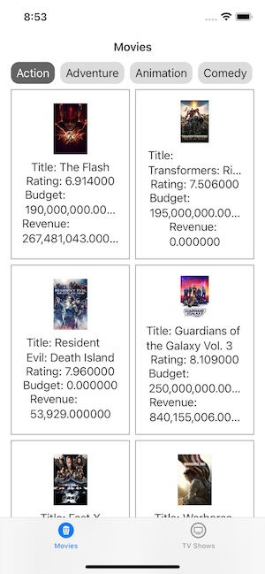

# TMDB Assignment

## Introduction

The app shows two tabs and displays movies and TV shows from the [The Movie DB API](https://developer.themoviedb.org). You can filter the movies and TV shows using the category picker in the top. It has Pull-To-Refresh and Infinite-Scrolling.

## Important Comments

At first I wanted to do the app as much reactive as I could using [RXSwift](https://github.com/ReactiveX/RxSwift). I did some tests calling the API requests in a reactive manner, which I left in the code. To be honest I don't have that much experience using RXSwift, and while doing the test (which is working ATM) I realized that it doesn't have much sense to do it Reactive while using SwiftUI that already provides a reactive way to update the UI. It was overcomplicating things. If I had built the UI using UIKit it would have been much more useful.

So after my first test I decided to do it in the way I would have done it in the beginning, and that is using `async/await`. SwiftUI is already reactive as in changing the view when the `@Published` properties are updated. I also used combine to call to the Movies/TVShows request when the `selectedGenre` is changed.

What would I do next:
  - Handle the errors in the views.
  - Create view components for reusing views (like the Movie/TVShow cell)
  - Add a placeholder for the poster images

## How to build the app

 - Install the Cocoapods dependencies running `pod install`
 - Open `TMDB-Assignment.xcworkspace`
 - Add your TMDB API token to `APIRequest.swift` file
 - Run the app 

## General Architecture

### UI

The app is built using **SwiftUI** as I think for a simple app like this it's very fast to build a prototype.

#### Pros
  - Building the screens and components is very fast
  - Built-in reactive updates to the view using `ObservableObject` and `@Published` 

#### Cons
  - Supporting iOS 14 hasn't been as smooth as it should've been. 
    - Use third-party library to add `Pull-To-Refresh` instead of `.refreshable {}`
    - Use third-party library to use remote images instead of `AsyncImage`

### Navigation

For the navigation between the views, the app is using `UIKit`. So, all of the views are `UIHostingViewController` with SwiftUI views inside. With this approach, we have the flexibility to use both `UIKit` and `SwiftUI` for the views. On top of that, navigation in SwiftUI is not MVVM friendly.

We are using a `Router` for every view. In this app they're empty, because there is no navigation. In case any view required navigation, we could call the `router.present(...)` from the ViewModel, so the view is not coupled with the navigation.

### MVVM

The app is using an MVVM architecture pattern where all of the views logic happens inside the views `ViewModel`. This means we can decouple the logic (+ navigation) from the view.

Also using a `Configurator` for each view allows us to present this view from anywhere in the app.

### Protocol Oriented

The app is built using a protocol oriented approach, meaning that almost all of the properties of the objects can be replaced with mocked types. This means that testing the components is very easy.

For example, to test the `MoviesRepository` logic, we could create a mock conforming `APIClientProtocol` for its `apiClient` property, so it's easily testable. 

### Repository pattern

I like to use the repository pattern to put all of the API/DB related calls inside, meaning that if you want to do something related with Movies, you'll always use `MovieRepository`. This way, if something changes you'll only need to update/change the specific repository and not change anything else from the ViewModel.

If the app would have used database/CoreData, I would've created two properties in the repositories: `RemoteDataSource` and `LocalDataSource`. So `RemoteDataSource` would contain the logic to call the API and `LocalDataSource` the logic for how to store it in the device.

### Network

The requests to API is very straightforward. A generic `APIClient` that makes a request to wherever `Endpoints`. The cool thing is that this APIClient is generic and decodes directly to the Model you asked for.

The endpoints are very easy to use and to extend using `enums`.

For the paginated response I created a model `PaginatedAPIResult` that contains a generic property for `results`, also very easy to use.

## Libraries used

I'm not a big fan of using third-party libraries, instead I tend to do create my own components and try to use as much as we can what the system offers. In this case, I had to use 3 different libraries due to having to support iOS 14. Even if I don't like using them that much, in this case I think it's worth using them because an hypothetical future when the app updates the minimum sdk version to iOS15/16, it's very easy to remove this libraries and use what the system provides.

#### SwiftUI-Pull-To-Refresh (used the code)
> https://github.com/Geri-Borbas/iOS.Blog.SwiftUI_Pull_to_Refresh

In order to add `Pull-To-Refresh` to the lists supporting iOS 14. If the app supported iOS 15/16 I would have used the `.refreshable {}` instead.

####  SwiftUI introspect
> https://github.com/siteline/SwiftUI-Introspect

Used by the SwiftUI-Pull-To-Refresh library to be able to add the `UIRefreshControl` to the `UIScrollView`'s inside the SwiftUI component `ScrollView`

#### Kingfisher
> https://github.com/onevcat/Kingfisher

In order to display images using a URL. If the app supported iOS 15+ I would have used `AsyncImage`.

#### SwiftLint
> https://github.com/realm/SwiftLint

A tool to enforce Swift style and conventions. I think it's a good tool to have when working in a team to ensure all the code is styled the same.