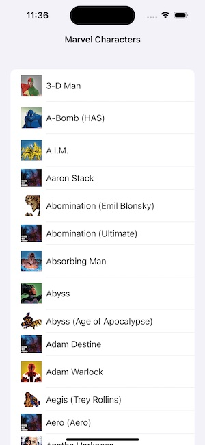
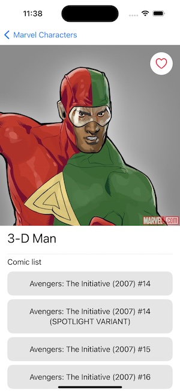

# Marvel SwiftUI

## Introduction

The app displays a list of Marvel characters from [Marvel API](https://developer.marvel.com/docs). It lets you go into detail of each character to see the list of comics this character appears and mark the character as favorite.

## How to build the app

 - Open `marvel-swiftui.xcodeproj`
 - Add your Marvel API tokens to `Secret.swift` file
 - Optional: Install SwiftLint and Sourcery
 - Run the app 

## General Architecture

### UI

The app is built using **SwiftUI** as I think for a simple app like this it's very easy and fast to build a prototype.

### Navigation

For the navigation between the views, the app is using `UIKit`. So, all of the views are `UIHostingViewController` with SwiftUI views inside. With this approach, we have the flexibility to use both `UIKit` and `SwiftUI` for the views. On top of that, navigation in SwiftUI is not MVVM friendly.

We are using a `Router` for every view. Using this pattern is really easy to present any screen.

### MVVM

The app is using an MVVM architecture pattern where all of the views logic happens inside the views `ViewModel`. This means we can decouple the logic (+ navigation) from the view.

Also using a `Configurator` for each screen allows us to configure and present this view from anywhere in the app.

### Protocol Oriented

The app is built using a protocol oriented approach, meaning that almost all of the properties of the objects can be replaced with mocked types. This means that testing the components is very easy.

For example, to test the `CharactersRepository` logic, I created two mocks to test it's functionality: one for `APIClientProtocol` and another one for `CoreDataStackProtocol`.

### Repository pattern

I like to use the repository pattern to put all of the API/DB related calls inside, meaning that if you want to do something related with Characters, you'll always use `CharactersRepository`. This way, if something changes you'll only need to update/change the specific repository and not change anything else from the ViewModel.

If the app would have used API and database/CoreData calls more extensively, I would've created two properties in the repositories: `RemoteDataSource` and `LocalDataSource`. So `RemoteDataSource` would contain the logic to call the API and `LocalDataSource` the logic for how to store it in the device.

### Network

The requests to API is very straightforward. A generic `APIClient` that makes a request to wherever `Endpoints`. The cool thing is that this APIClient is generic and decodes directly to the Model you asked for.

The endpoints are very easy to use and to extend using `enums`.

### Unit Tests

I added some unit tests for the `CharactersRepository` and the screen ViewModels as a way to show how to unit test the class using the mocks generated by Sourcery.

## Libraries used

I'm not a big fan of using third-party libraries, instead I tend to do create my own components and try to use as much as we can what the system offers. Taking Kingfisher aside, the other libraries are used to improve the development experience.

#### SwiftyBeaver
> https://github.com/SwiftyBeaver/SwiftyBeaver

Great library for logging. It lets you add `destinations` to your logs, so you print this logs locally or remotely.

#### Kingfisher
> https://github.com/onevcat/Kingfisher

In order to display images using a URL. The default `AsyncImage` (which I used at the beginning) does not cache images and in general Kingfisher is still more reliable and better.

#### SwiftLint (as a run script)
> https://github.com/realm/SwiftLint

A tool to enforce Swift style and conventions. I think it's a good tool to have when working in a team to ensure all the code is styled the same.

####  Sourcery (as a run script)
> https://github.com/krzysztofzablocki/Sourcery

Code generator used to generate the protocol mocks automatically. Among other things, it's really useful for generating the mocks used in testing.